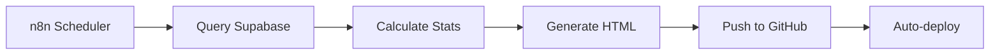

# Architecture Modulaire Mapikids Website

## 🎯 Objectifs

Cette architecture modulaire résout les problèmes de duplication et prépare les évolutions futures :

1. **Stats statiques générées par n8n** : Réduction de la charge Supabase
2. **Future app web mobile** : Architecture SPA-ready
3. **Maintenance simplifiée** : Composants réutilisables
4. **SEO optimisé** : Titres et descriptions dynamiques

## 📁 Structure des dossiers

```
Website/
├── src/                          # Sources modulaires
│   ├── components/              # Composants réutilisables
│   │   ├── head-seo.html       # Meta tags SEO
│   │   ├── nav.html            # Navigation
│   │   ├── footer.html         # Footer avec mentions
│   │   ├── decorations.html    # Formes décoratives
│   │   └── modal-mentions.html # Modale mentions légales
│   ├── templates/              # Templates de pages
│   │   ├── base.html           # Template standard
│   │   ├── spa.html            # Template pour /app
│   │   └── stats-n8n.html      # Template pour n8n
│   ├── config/                 # Configuration
│   │   └── pages.json          # Config SEO par page
│   └── pages/                  # Contenu des pages (futur)
├── dist/                       # Pages générées (déployé)
├── build-simple.js            # Script de build
├── package.json               # Configuration npm
└── .github/workflows/         # CI/CD GitHub Actions
    └── build-deploy.yml       # Workflow automatique
```

## 🔧 Configuration des pages (src/config/pages.json)

```json
{
  "stats.html": {
    "title": "Statistiques en temps réel • {{TOTAL_PLAYGROUNDS}} aires de jeux",
    "description": "{{TOTAL_PLAYGROUNDS}} aires, {{TOTAL_PHOTOS}} photos. Mis à jour le {{LAST_UPDATE}}.",
    "template": "base.html"
  }
}
```

## 🚀 Utilisation

### Build local
```bash
npm run build
```

### Déploiement automatique
- Push sur `main` → GitHub Actions build → GitHub Pages deploy

### Pour n8n (stats dynamiques)
```bash
# Template spécialisé avec placeholders
src/templates/stats-n8n.html

# Placeholders disponibles:
{{TOTAL_PLAYGROUNDS}}     # Nombre total d'aires
{{TOTAL_PHOTOS}}          # Nombre de photos
{{TOTAL_ENRICHED}}        # Aires enrichies
{{TOTAL_RATINGS}}         # Nombre de notes
{{AVG_RATING}}            # Note moyenne
{{LAST_UPDATE}}           # Date de mise à jour
{{DEPARTMENT_RANKING}}    # Top départements (HTML)
{{TOP_EQUIPMENTS}}        # Équipements populaires (HTML)
{{LAST_ENRICHED}}         # Dernières aires enrichies (HTML)
{{EDITS_HISTORY_DATA}}    # Données pour graphique (JSON)
```

## 📊 Workflow n8n proposé



### Étapes n8n :
1. **Cron** : Exécution toutes les heures
2. **Supabase queries** : Récupérer toutes les données nécessaires
3. **Data processing** : Calculer stats, rankings, graphiques
4. **Template rendering** : Remplacer placeholders dans `stats-n8n.html`
5. **GitHub API** : Push du fichier `stats.html` généré
6. **Auto-deploy** : GitHub Actions déploie automatiquement

## 🎨 Composants partagés

### Navigation
- Logo avec lien vers accueil
- Cohérent sur toutes les pages

### Footer
- Informations Mapikids
- Liens mentions légales et OpenStreetMap
- Liens contextuels (retour accueil sur stats)

### SEO
- Meta tags dynamiques
- Open Graph optimisé
- Twitter Cards
- Favicons complets

### Décorations
- Formes flottantes cohérentes
- Animations CSS synchrones

## 🔮 Évolutions futures

### App Web Mobile (/app)
```bash
# Structure pour SPA
src/pages/app/
├── components/
│   ├── MapView.jsx
│   ├── PlaygroundCard.jsx
│   └── SearchBar.jsx
├── styles/
│   └── app.css
└── app.js
```

### Templates additionnels
- `blog.html` : Pour futurs articles
- `legal.html` : Pages légales détaillées
- `api.html` : Documentation API publique

## ⚡ Avantages

### Performance
- ✅ Stats statiques = zéro charge Supabase
- ✅ Pages optimisées et minifiées
- ✅ Assets mis en cache

### Maintenance  
- ✅ Une seule source par composant
- ✅ Modification centralisée
- ✅ Tests automatisés possibles

### SEO
- ✅ Titres dynamiques avec données temps réel
- ✅ Meta descriptions optimisées
- ✅ Structured data ready

### Évolutivité
- ✅ Architecture SPA-ready
- ✅ Composants réutilisables
- ✅ Configuration centralisée

## 🔄 Migration actuelle → nouvelle architecture

### Phase 1 : ✅ Terminée
- Architecture modulaire en place
- Build automatique fonctionnel
- Templates et composants créés

### Phase 2 : À venir
- Migration contenu complet des pages existantes
- Configuration n8n pour stats dynamiques
- Tests et validation

### Phase 3 : Futur
- Développement app web mobile
- Optimisations performance
- Nouvelles fonctionnalités